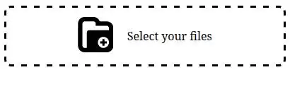

# A vanilla javascript Web Component for obtain EXIF data

A simple solution for obtaining EXIF data from photos (the main goal), but you can also drop or choose[^1] any kind of files or directories[^2].

## Install

## Getting started

You can self-hosted by copying the `dist/drop-photo-for-exif-0.1.1.min.js` file or using it from a CDN in the following way

```html
<body>
    <drop-photo-for-exif></drop-photo-for-exif>
    <script src="https://cdn.jsdelivr.net/gh/migupl/drop-photo-get-exif-data/dist/drop-photo-for-exif-0.1.1.min.js"></script>
</body>
```

You can use the file *index.html* of the project as a small demo.

A more interesting example could be the integration between images with location data and [maps](https://github.com/migupl/vanilla-js-web-component-leaflet-geojson), as we can see [here](https://migupl.github.io/where-was-the-photo-taken/).

### Attributes

The Web Component allows a *drag-text* attribute with the text to display. The default is "Drop files here".
Web Component allows the following attributes:
- *drag-area-background*: the background color of the drag area when dragging files. Default, '#E8E8E8'.
- *drag-text*: the text for dragging files. Default, 'Drop files here or'.
- *drop-text*: the text for dropping files. Default, 'Drop files here'.
- *upload-text*: the text for uploading files. Default, 'upload files'.

By example, the following code

```html
<body>
    <drop-photo-for-exif drag-text="Select your files"></drop-photo-for-exif>
    <script src="https://cdn.jsdelivr.net/gh/migupl/drop-photo-get-exif-data/dist/drop-photo-for-exif-0.1.1.min.js"></script>
</body>
```

shows




## Events

See the _index.html_ file for a simple example.

### Images

The Web Component *drop-photo-for-exif* exposes the following information about the images dragged through the event 'drop-photo-for-exif:image'.

By example, dragging the image ./assets/favicon.ico of this project you get

```javascript
{
    name: "favicon.ico",
    image: File { name: "favicon.ico", lastModified: 1676626568947, webkitRelativePath: "", size: 435, type: "image/x-icon" },
    location: undefined,
    exif: {
        "Image Width": {
            "value": 32,
            "description": "32px"
        },
        "Image Height": {
            "value": 32,
            "description": "32px"
        },
        "Bit Depth": {
            "value": 8,
            "description": "8"
        },
        "Color Type": {
            "value": 6,
            "description": "RGB with Alpha"
        },
        "Compression": {
            "value": 0,
            "description": "Deflate/Inflate"
        },
        "Filter": {
            "value": 0,
            "description": "Adaptive"
        },
        "Interlace": {
            "value": 0,
            "description": "Noninterlaced"
        }
    }
}
```

_location_ is in the form

```javascript
{
    latitude: "43.66366 N",
    longitude: "7.357704 W"
}
```

### Rest of files

The Web Component *drop-photo-for-exif* through the event 'drop-photo-for-exif:file' for each of the others dropped files.

In the example, some processing is done for GeoJSON[^3] files.

### On complete

The Web Component *drop-photo-for-exif* through the event 'drop-photo-for-exif:completed-batch' when all dropped files have been processed.

## Helpers

A [container is used for hot reloading](https://github.com/migupl/hot-reloading-container) during development.

[File drag and drop](https://developer.mozilla.org/en-US/docs/Web/API/HTML_Drag_and_Drop_API/File_drag_and_drop).

[A complete guide on shadow DOM and event propagation](https://pm.dartus.fr/blog/a-complete-guide-on-shadow-dom-and-event-propagation/)

[ExifReader](https://github.com/mattiasw/ExifReader) is a JavaScript library that parses image files and extracts the metadata.

[Highlight.js](https://highlightjs.org/). Syntax highlighting for the Web.

Web Component behind this idea are:
- [Yet Another GitHub Corner](https://github.com/migupl/yagc)

Good luck and I hope you enjoy it.

## License

[MIT license](http://www.opensource.org/licenses/mit-license.php)

[^1]: Dropping files is the default interaction, but when a mobile browser is detected you will be able to select the files to add
[^2]: Only one level deep
[^3]: GeoJSON is a format for encoding a variety of geographic data structures ([GeoJSON Specification (RFC 7946)](https://tools.ietf.org/html/rfc7946))

